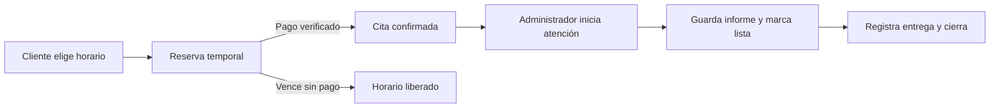

# Auditoría de intranet y citas — 1 de octubre de 2026

## Recomendación

Conservar la reserva de horarios, la confirmación automática al pagar y la
liberación de reservas impagas. Corregir primero las inconsistencias de pagos,
estados y reprogramación. Después simplificar la agenda para que el administrador
trabaje principalmente con tres acciones: iniciar atención, guardar el informe
y dejar la moto lista, y registrar la entrega.

La auditoría propone cambios; no modifica las reglas de negocio ni despliega
cambios en producción.

## Alcance y evidencia

- Código local del frontend, contratos, API, servicios y restricciones SQL.
- Navegador real: login de administrador, dashboard, agenda y configuración.
- API real y PostgreSQL real en una base temporal independiente, creada con las
  ocho migraciones del proyecto y cuentas ficticias.
- Flow simulado en el límite del proveedor, usando el servicio de pagos real y
  registros persistidos en PostgreSQL. No se realizaron cobros ni se contactó a
  clientes.
- Pasaron 81 pruebas existentes del backend y 13 del frontend. Estas pruebas
  no cubren los fallos reproducidos abajo.
- Artefactos locales en `output/playwright/`: `audit-flow.mjs`,
  `audit-results.json`, `audit-run.log`, `agenda-recepcionada.png` y
  `agenda-fecha-vacia.png`. Esta carpeta está ignorada por Git.

No se verificó una sesión de administrador en producción ni el comportamiento
del proveedor real de pagos. Los resultados corresponden al código local.
Al terminar se detuvieron los procesos de prueba y se eliminó la base temporal;
se conservaron la base local original y los artefactos de evidencia.

## Fallos reproducidos

### 1. Un pago recibido puede volver a aparecer como pendiente — prioridad alta

Reproducción: reservar, confirmar un pago por el total, iniciar trabajo, marcar
lista y finalizar con el valor predeterminado del formulario. La API responde
201; el pago conserva `paid`, pero la boleta cambia de `paid` a `pending` y se
borra `paid_at`.

Causa: `CompleteWorkModal.tsx:32` inicia el formulario en `pending`.
`customer-service.ts:227` sobrescribe el estado de la boleta con ese valor sin
considerar los pagos existentes.

Cambio recomendado: derivar el monto pagado y el saldo de los pagos registrados;
preservar el pago confirmado. Registrar por separado cualquier pago del saldo
en taller. Un abono debe diferenciarse del pago total. El formulario técnico no
debe modificar silenciosamente un cobro confirmado.

### 2. Dos solicitudes pueden crear dos órdenes de pago — prioridad alta

Reproducción: ejecutar dos llamadas simultáneas a `createForAppointment` para
la misma cita. Se crean dos órdenes del proveedor simulado y dos filas en
`payments`. Se comprobó la duplicación de órdenes, no un cobro doble real.

Causa: `payment-service.ts:92` consulta si hay una orden existente antes de
crear otra, sin exclusión entre solicitudes concurrentes. Deshabilitar el botón
en el frontend no cubre dos pestañas o reintentos de red.

Cambio recomendado: garantizar una única operación de creación por cita con
una clave idempotente y coordinación persistida. Manejar también la caída entre
la creación de la orden externa y su registro local; un simple bloqueo de UI
no resuelve ese caso.

### 3. Se puede finalizar una reserva sin pagar ni empezar el trabajo — prioridad alta

Reproducción: enviar `complete-work` sobre una cita `pending_payment`. Responde
201 y cambia directamente a `completed`, creando informe y boleta. La agenda
también muestra «Registrar atención» para ese estado.

Causa: `customer-service.ts:185` solo rechaza citas canceladas, completadas o
ausentes. No exige un estado operativo válido para finalizar la atención.

Cambio recomendado: restringir el cierre técnico a los estados acordados de
atención. Si se permite atender sin prepago, debe existir una acción explícita
de recepción con pago en taller y trazabilidad, en lugar de saltar desde una
reserva pendiente de pago a completada.

### 4. Se puede completar una cita sin informe — prioridad alta

Reproducción: avanzar una cita a `ready` y enviar `status=completed` a la ruta
general de estados. Responde 200, con cero informes técnicos para esa cita.

Causa: `appointment-rules.ts:27` permite `ready → completed` y
`appointment-service.ts:377` no comprueba que exista informe. Este camino evita
las garantías de `completeAppointmentWork`.

Cambio recomendado: distinguir «guardar informe / lista para retiro» de
«entregada / completada». El cierre debe tener un único camino que valide
informe, saldo o crédito autorizado e historial.

### 5. Reprogramar por segunda vez devuelve error 500 — prioridad alta

Reproducción: reprogramar una cita confirmada; queda `requested`. Reprogramarla
de nuevo devuelve 500. PostgreSQL rechaza el historial `requested → requested`
por `appointment_status_history_changed` (`23514`, expuesto por Prisma como
`P2039`). La transacción se revierte.

Causa: `appointment-service.ts:257` siempre fuerza `requested` y en la línea
263 escribe un cambio de estado aunque el estado no haya cambiado.

Cambio recomendado: registrar los cambios de horario como eventos propios;
escribir historial de estado solo si el estado cambia. Para reducir trabajo
manual, conservar la confirmación de una cita pagada cuando el cliente elige un
horario válido, sujeto a una política de anticipación. No volver a cobrarla.

### 6. Competir por el mismo horario produce un error interno — prioridad media

Reproducción: dos reservas simultáneas para el mismo horario. Una responde 201
y la otra 500. Se confirmó `P2034` por conflicto de transacción. No se observó
doble reserva.

Cambio recomendado: mantener las transacciones y restricciones que protegen el
horario; convertir conflictos de concurrencia en una respuesta 409 y actualizar
la disponibilidad. Si se añaden reintentos, deben ser acotados y volver a validar
la reserva.

### 7. Borrar la fecha hace caer la agenda — prioridad media

Reproducción en navegador: borrar el input «Fecha de agenda». La intranet
muestra `Unexpected Application Error! / Invalid time value`.

Causa: `AdminAppointmentsPage.tsx:124` acepta el valor vacío y
`agenda-dates.ts` lo convierte directamente en una fecha y llama `toISOString`.

Cambio recomendado: mantener la última fecha válida mientras se edita, validar
antes de calcular el rango y ofrecer una recuperación dentro de la aplicación.

### 8. Una cita recepcionada no tiene botón para iniciar trabajo — prioridad media

Reproducción en navegador: una cita `checked_in` muestra «Cancelar» y
«Registrar atención», pero no «Iniciar trabajo». El backend sí admite la
transición a `in_service`.

Causa: `AdminAppointmentCard.tsx:97` muestra «Iniciar trabajo» únicamente para
`confirmed`. Tampoco hay acciones para marcar recepción o inasistencia, aunque
el backend admite esos estados.

Cambio recomendado: alinear las acciones del panel con las transiciones
permitidas. Mostrar una acción principal por etapa y las excepciones en un
menú secundario. La inasistencia requiere que ya haya transcurrido la hora de
la cita y una comprobación del administrador.

## Casos que requieren tratamiento operativo

**Pago posterior a una cancelación.** Se confirmó que el servicio registra el
pago y una boleta pagada, pero conserva la cita cancelada y solo añade el evento
genérico `payment.confirmed`. Conservar el dinero recibido es correcto; hace
falta destacar el caso para revisión, reembolso o nueva reserva. No reactivar
automáticamente un horario que otra persona puede haber reservado.

**Pago que no se puede iniciar.** El frontend crea primero la cita y después
la orden de pago. Si falla la segunda operación, la reserva permanece bloqueada.
El cliente no puede cancelar una `pending_payment` —se comprobó el 409— y la
lista no ofrece una acción de reanudar el pago. Añadir «Reintentar pago» sobre
la misma cita y «Abandonar reserva»; comprobar la vigencia antes de reutilizarla.

**La agenda no se actualiza automáticamente.** Sus consultas no tienen
`refetchInterval`; además `App.tsx` desactiva `refetchOnWindowFocus`. Un pago
confirmado desde otra sesión puede no aparecer hasta recargar. Recomiendo una
actualización periódica mientras el panel esté visible, con indicador de última
actualización, antes de introducir una integración de tiempo real.

**Los horarios públicos y configurados difieren.** La portada muestra sábado
09:30–14:00, mientras la base creada desde las migraciones también ofrece
15:00–18:00 ese día. Hay textos de horario y colación fijos en el frontend.
Usar la configuración del taller como fuente común. Esta diferencia se verificó
en los datos de referencia locales, no en los horarios de producción.

**Capacidad del taller.** Disponibilidad y creación bloquean globalmente cualquier
solapamiento, aunque existan varias bahías. Las pruebas existentes exigen este
comportamiento. Conservarlo si el taller atiende una moto a la vez; si atiende
varias, cambiar conjuntamente cálculo de capacidad, asignación y restricciones.
No activar reservas simultáneas solo por tener varias bahías configuradas.

## Automatización recomendada

1. Mantener la confirmación por pago y la caducidad de reservas. Ambas funcionaron
   en las pruebas: el pago llevó a `confirmed`; la caducidad canceló la reserva
   y devolvió el horario a disponibilidad.
2. Separar en la agenda «Por pagar», «Confirmadas», «En taller» y «Listas para
   retiro». Mostrar primero hoy y los trabajos pendientes de días anteriores,
   para que una moto que sigue en taller no quede escondida por su fecha original.
3. Precargar el informe con los servicios reservados y presets existentes;
   permitir editar el trabajo real. Calcular saldo automáticamente.
4. Ofrecer reprogramación al administrador con disponibilidad real, motivo e
   historial. La intranet actual solo expone reprogramación al cliente.
5. Añadir recordatorios antes de la cita y avisos de moto lista. El código actual
   de WhatsApp usa `NoopWhatsAppNotifier`: no entrega mensajes, aunque existan
   llamadas a `send`. El enlace `wa.me` abre un chat manual.
6. Ejecutar recordatorios y vencimientos mediante tareas persistidas con
   deduplicación, reintentos y registro de entrega. El `setInterval` actual se
   detiene cuando la instancia duerme; no garantiza un envío a una hora exacta.
7. Mostrar excepciones al administrador: pago recibido con cita cancelada,
   fallo del proveedor, reserva vencida o conflicto de horario. Mantener manuales
   la recepción real, el trabajo técnico, la entrega y las decisiones de reembolso.

## Orden sugerido de implementación y aceptación

**Primera etapa: integridad.** Corregir pagos que se sobrescriben, órdenes
duplicadas, cierres sin atención/informe y reprogramación. Añadir pruebas con
PostgreSQL real para restricciones y concurrencia, incluyendo abonos, pago total,
repetición de webhook y pago tras cancelación.

**Segunda etapa: comodidad.** Corregir fecha vacía y acciones por estado; añadir
reanudar pago, reprogramación administrativa y actualización de agenda. Comprobar
los recorridos desde el navegador con clientes y administradores distintos.

**Tercera etapa: avisos.** Integrar un proveedor real de notificaciones y tareas
persistentes. Verificar envío único, fallo/reintento y recuperación tras reiniciar.

La aceptación debe incluir que una boleta pagada siga pagada al terminar el
trabajo; una reserva concurrente perdedora reciba 409; varias reprogramaciones
válidas funcionen; los cierres inválidos se rechacen; y todas las etapas tengan
una acción visible y consistente en el panel.
