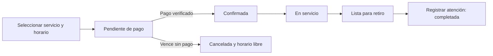

# Flujo actual y alternativas de agendamiento

Fecha: 1 de octubre de 2026.

## Mejoras guardadas a petición del usuario

El usuario expresó interés en las siguientes mejoras de la auditoría y pidió
conservarlas para continuar el diseño:

- Actualización automática de la agenda mientras el panel esté abierto.
- Visibilidad de los trabajos pendientes de días anteriores.
- Reprogramación desde el administrador, validando disponibilidad.
- Reintentar el pago o abandonar una reserva cuyo pago no se pudo iniciar.
- Cálculo automático del saldo, conservando los pagos ya recibidos.
- Recordatorios de cita y avisos de moto lista para retiro.

Estado: propuestas guardadas, pendientes de implementación. El usuario todavía
no ha elegido una de las alternativas de flujo descritas abajo.

## Flujo que tiene actualmente el proyecto

1. El cliente inicia sesión, selecciona servicios, fecha, horario y WhatsApp.
   La aplicación utiliza su Honda NAVI y calcula duración y precio de servicios.
2. El backend valida el horario y crea una cita `pending_payment` con un bloqueo
   temporal. La duración del bloqueo proviene de la configuración de pagos;
   su valor predeterminado es 30 minutos.
3. El frontend solicita una orden de Flow y redirige al cliente para pagar.
   La configuración admite pago total o abono fijo/porcentual. No se comprobó
   qué modalidad está seleccionada actualmente en producción.
4. El backend consulta a Flow para verificar el pago. Si corresponde, registra
   el pago y la boleta, y cambia la reserva a `confirmed` automáticamente.
   Una cita pagada nueva no necesita una segunda confirmación del administrador.
5. Si el bloqueo vence sin pago, el mantenimiento cancela la reserva y libera
   el horario. La tarea periódica corre cada cinco minutos mientras el servidor
   está activo; también se ejecuta al arrancar. No es un vencimiento de ejecución
   garantizada al segundo exacto.
6. En la agenda el administrador puede pasar de confirmada a `in_service` con
   «Iniciar trabajo», y de ahí a `ready` con «Lista para retiro».
7. «Registrar atención» abre el informe de trabajos, pendientes y recomendaciones.
   Al guardarlo se actualiza/crea la boleta y la cita pasa a `completed`.
   Actualmente ese guardado también se permite desde estados anteriores, lo
   que constituye uno de los fallos de la auditoría.
8. El contacto de WhatsApp se hace mediante un enlace que abre el chat. El
   proveedor de mensajes automáticos es una implementación que no envía mensajes.

Excepciones actuales:

- Reprogramar una cita confirmada la convierte en `requested`, y el administrador
  debe volver a confirmarla. La segunda reprogramación desde `requested` falla.
- El backend admite recepción (`checked_in`) e inasistencia (`no_show`), pero
  la agenda no ofrece todas las acciones necesarias para operarlos.
- El cierre general por estado puede evitar el informe; finalizar con el valor
  predeterminado de pago puede marcar pendiente una boleta ya pagada.
- Una orden de pago que falla después de crear la cita deja el horario retenido,
  sin una acción clara en la lista del cliente para reanudar o abandonar.

Las reproducciones completas y prioridades están en
[Auditoría de intranet y citas](auditoria-intranet-citas.md).

## Etapas operativas comunes propuestas

Las alternativas siguientes cambian cómo se confirma y paga una cita. Una vez
confirmada, recomiendo el mismo recorrido del taller:

**Confirmada → En atención → Lista para retiro → Entregada/completada.**

Acciones principales del administrador:

1. **Iniciar atención:** registrar la recepción y el inicio del trabajo.
2. **Guardar informe y marcar lista:** dejar trabajo realizado, pendientes y
   recomendaciones, conservando todos los pagos. Notificar al cliente.
3. **Entregar y cerrar:** registrar la entrega y comprobar el saldo o una
   excepción de crédito autorizada.

Así el informe describe el trabajo técnico y el cierre representa la entrega
real. Guardar un informe no debe fingir que la moto ya fue retirada.

## Opción A: pago total y confirmación automática

**Elegir horario → pagar el total → confirmación automática → atención → retiro.**

El sistema se ocupa de validar disponibilidad, confirmar pagos, recordar la
cita, liberar reservas impagas y avisar cuando la moto está lista.

El administrador interviene en atención, informe, entrega y excepciones.

Es adecuada para servicios con alcance y precio definidos. Es la alternativa
más cercana al flujo actual. Si aparecen trabajos adicionales, necesitan una
aprobación y cobro separados; el pago original debe conservarse.

## Opción B: abono y confirmación automática

**Elegir horario → pagar abono → confirmación automática → atención → saldo → retiro.**

La agenda se confirma con el abono sin revisión manual. El panel muestra total
del servicio, abono recibido y saldo pendiente. Los adicionales aprobados se
registran por separado y ajustan el saldo de forma trazable.

Es adecuada cuando se quiere reservar el tiempo del taller sin cobrar todo
antes de revisar la moto. Reduce la necesidad de coordinar cada reserva por
WhatsApp, pero requiere corregir y completar la contabilidad de abonos y saldos.

El backend ya contempla modalidades de abono; eso no significa que el recorrido
completo de cobro del saldo y entrega esté listo.

## Opción C: reserva automática y pago en taller

**Elegir horario → confirmación automática → recordatorio → atención → pago → retiro.**

El cliente no pasa por Flow para reservar. El taller registra el pago al terminar
y el administrador solo gestiona excepciones de agenda y atención.

Es adecuada si la facilidad para reservar es la prioridad y se acepta reservar
capacidad sin prepago. Tiene mayor exposición a reservas que no se presentan;
conviene limitar reservas activas por cliente y facilitar cancelación/reprogramación.
No requiere perseguir manualmente todas las confirmaciones si se adopta una
política automática clara.

Esta alternativa cambia la regla actual de exigir un pago para confirmar.

## Opción D: solicitud y aprobación del taller

**Solicitar atención → revisar alcance/horario → aprobar → pagar o abonar → confirmar → atender.**

El administrador revisa únicamente las solicitudes que requieren evaluación
previa y propone un horario o condición de servicio. La solicitud debe tener
un plazo de respuesta; los horarios provisionales también deben vencer.

Es adecuada para reparaciones de duración incierta o casos especiales. Añade
trabajo manual y espera para el cliente, por lo que no la recomendaría como
camino obligatorio de cada cambio de aceite o mantención estándar.

Si el presupuesto solo puede conocerse al inspeccionar la moto, se puede reservar
un diagnóstico con A o B y solicitar aprobación antes de ejecutar la reparación.
Eso no exige revisar manualmente la reserva inicial de diagnóstico.

## Comparación y recomendación

| Alternativa | Confirmación                                  | Pago para reservar | Trabajo de agenda del administrador | Uso recomendado                           |
| ----------- | --------------------------------------------- | ------------------ | ----------------------------------- | ----------------------------------------- |
| A           | Automática al pagar                           | Total              | Bajo                                | Servicios de precio definido              |
| B           | Automática al abonar                          | Abono              | Bajo; saldo al entregar             | Reservar tiempo con mayor flexibilidad    |
| C           | Automática al reservar                        | Ninguno            | Bajo; gestión de inasistencias      | Pago presencial como regla del taller     |
| D           | Revisión previa + cumplimiento de condiciones | Según aprobación   | Mayor                               | Casos excepcionales o reparación incierta |

Recomiendo **A como primera mejora**, por su cercanía con lo existente. Si el
taller prefiere no cobrar todo antes de atender, **B** es una evolución razonable
después de corregir abonos y saldos. Mantendría **D** como excepción para casos
especiales y usaría A/B para reservar un diagnóstico cuando hace falta evaluar
antes de presupuestar.

Para cualquiera de las alternativas, corregir primero los fallos reproducidos
de pagos, reprogramación, concurrencia y cierre. Automatizar confirmaciones,
avisos y actualización del panel; las etapas físicas de atención y entrega se
registran por el administrador. Los recordatorios necesitan un proveedor real
y tareas persistidas con reintentos y deduplicación.
